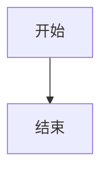

# Markit

这是一款网页版的在线 Markdown 编辑器网站，以快捷键操作著称，大多数操作均通过快捷键完成，来实现用户在网页上的鼠标使用的低频性，进一步保障用户的沉浸式编写体验，也将网站的设计风格进一步的简约化。

## 快捷键一览 (支持 macOS 和 Windows/Linux)

-   `Cmd/Ctrl + Shift + S` - 侧边栏的隐藏&展示
-   `Cmd/Ctrl + Shift + A` - 新建文件
-   `Cmd/Ctrl + Shift + ↑/↓` - 文件上下切换
-   `Cmd/Ctrl + Shift + P` - 切换编辑&预览模式
-   `Cmd/Ctrl + S` - 保存导出文档到本地
-   `Cmd/Ctrl + Shift + D` - 快速切换明暗主题
-   `Cmd/Ctrl + Shift + C` - 打开&关闭配置弹框
-   `Cmd + Ctrl + Option/Alt + P` - 推送到Github
-   `Cmd + Ctrl + Option/Alt + O` - 从Github拉取
-   `ESC` - 关闭设置弹窗
-   **导出图片** - 仅在预览模式下通过按钮操作

## 功能一览

-   支持上述的所有快捷键操作
-   支持多套预览主题
-   支持直接和 GitHub 仓库打通，进行文档的提交和同步
-   支持导出为预览图片
-   **🆕 GitHub 同步功能**：
    -   📤 Push: 将本地文件推送到 GitHub 仓库
    -   📥 Pull: 从 GitHub 仓库拉取最新文件
    -   🔐 安全认证: 支持 GitHub Personal Access Token
    -   📁 仓库管理: 支持指定 GitHub 仓库地址
-   **🆕 Mermaid 图表支持**：
    -   📊 流程图 (Flowchart)
    -   ⏱️ 时序图 (Sequence Diagram)
    -   📅 甘特图 (Gantt Chart)
    -   🏗️ 类图 (Class Diagram)
    -   🥧 饼图 (Pie Chart)
    -   🔄 状态图 (State Diagram)
-   **🆕 LaTeX 数学公式支持**：
    -   💡 行内公式：`$E = mc^2$` 或 `\(E = mc^2\)`
    -   📐 块级公式：`$$E = mc^2$$` 或 `\[E = mc^2\]`
    -   🔬 支持数学、物理、化学等各类公式
    -   🎨 自动主题适配（明暗主题）

## 三方库使用

-   ✅ hotkeys-js 快捷键能力 (跨平台支持)
-   ✅ marked.js markdown 解析
-   ✅ highlight.js 代码高亮
-   ✅ github-markdown-css github style
-   ✅ @zumer/snapdom 导出图片
-   ✅ 明暗主题切换
-   ✅ mermaid 图表渲染
-   ✅ KaTeX LaTeX 数学公式渲染

## 安装与运行

```bash
# 安装依赖
npm install

# 启动开发服务器
npm run dev

# 构建生产版本
npm run build
```

## 技术栈

-   Vue 3 + TypeScript
-   Vite
-   Markdown 解析与渲染
-   代码语法高亮
-   本地存储
-   Axios (GitHub API 调用)

## 项目结构

```
src/
├── components/          # 组件目录
│   ├── Sidebar.vue     # 侧边栏组件
│   ├── Toolbar.vue     # 工具栏组件
│   ├── Editor.vue      # 编辑器组件
│   ├── Preview.vue     # 预览组件
│   ├── Settings.vue    # 设置弹窗组件
│   └── StatusBar.vue   # 状态栏组件
├── types/              # 类型定义
│   └── index.ts        # 统一的类型定义
├── utils/              # 工具函数
│   ├── shortcuts.ts    # 快捷键管理工具
│   └── index.ts        # 工具函数导出
├── App.vue             # 主应用组件
├── main.ts             # 应用入口
└── style.css           # 全局样式
```

## GitHub 配置说明

### 1. 获取 GitHub Token

1. 访问 [GitHub Settings > Developer settings > Personal access tokens](https://github.com/settings/tokens)
2. 点击 "Generate new token (classic)"
3. 选择需要的权限（至少需要 `repo` 权限）
4. 复制生成的 token

### 2. 配置仓库信息

1. 在编辑器中按 `Cmd/Ctrl + Shift + C` 打开设置
2. 输入 GitHub Token
3. 输入仓库地址（格式：`https://github.com/username/repository`）
4. 点击保存

### 3. 使用 GitHub 功能

-   **Push**: 点击工具栏的 📤 Push 按钮，将本地文件推送到 GitHub
-   **Pull**: 点击工具栏的 📥 Pull 按钮，从 GitHub 拉取最新文件

## 组件说明

### Sidebar.vue - 侧边栏组件

-   文件列表管理
-   新建/删除文件
-   文件切换
-   设置入口

### Toolbar.vue - 工具栏组件

-   标题编辑
-   预览/编辑模式切换
-   导出功能
-   主题切换

### Editor.vue - 编辑器组件

-   Markdown 文本编辑
-   语法支持(Tab 缩进)
-   自动保存

### Preview.vue - 预览组件

-   Markdown 渲染
-   代码高亮
-   样式支持

### Settings.vue - 设置组件

-   主题配置
-   GitHub 集成设置

### StatusBar.vue - 状态栏组件

-   字数统计
-   实时时间显示

## 工具函数说明

### shortcuts.ts - 快捷键管理工具

-   统一的快捷键配置管理
-   跨平台快捷键支持 (macOS/Windows/Linux)
-   快捷键绑定和解绑管理
-   快捷键格式化和显示工具
-   条件性快捷键绑定支持

## Mermaid 图表使用说明

### 1. 基本语法

在 Markdown 中使用 Mermaid 图表，只需要将图表代码放在 ````mermaid` 代码块中：

````markdown

````

### 2. 支持的图表类型

-   **流程图 (Flowchart)**: 使用 `graph` 或 `flowchart` 关键字
-   **时序图 (Sequence Diagram)**: 使用 `sequenceDiagram` 关键字
-   **甘特图 (Gantt Chart)**: 使用 `gantt` 关键字
-   **类图 (Class Diagram)**: 使用 `classDiagram` 关键字
-   **饼图 (Pie Chart)**: 使用 `pie` 关键字
-   **状态图 (State Diagram)**: 使用 `stateDiagram-v2` 关键字

### 3. 主题适配

Mermaid 图表会自动适配当前的明暗主题，确保在不同主题下都有良好的显示效果。

### 4. 示例文件

项目根目录下的 `mermaid-example.md` 文件包含了各种图表类型的完整示例，可以作为参考。
