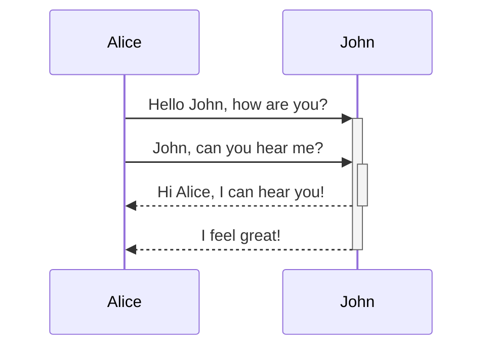

# 终于可以写文章了！！！

## 支持mermaid

## 支持Latex公式

$(a_1^2 + a_2^2 + \cdots + a_n^2)(b_1^2 + b_2^2 + \cdots + b_n^2) \geq (a_1b_1 + a_2b_2 + \cdots + a_nb_n)^2$

$$\int_{-\infty}^{\infty} e^{-x^2} dx = \sqrt{\pi}$$

## 图片

